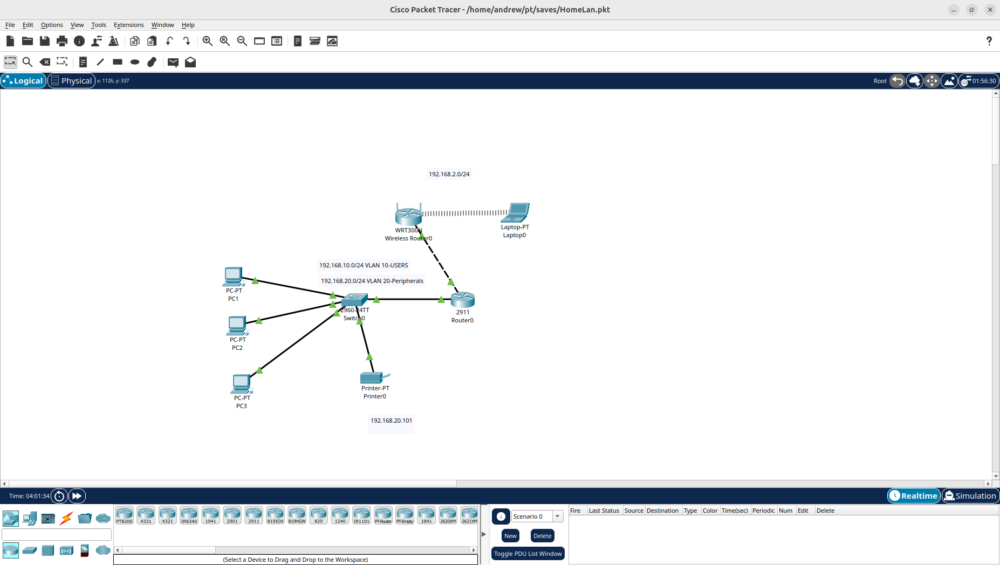

# Lab 01 — Home LAN with DHCP, VLANs, and ACLs

## Objective
Design and configure a small home network simulating my current home 
environment (3pc's, 1 printer, 1 laptop) but trying to make it more secure, implementing network segmentation, dynamic IP addressing, 
and access control policies.

## Tools Used
- Cisco Packet Tracer
- Cisco 2911 Router
- Cisco 2960 Switch
- WRT300N Wireless Router

## Network Topology

## Network Design
| Device  | VLAN | IP Address     | Method |
|---------|------|----------------|--------|
| PC1     | 10   | 192.168.10.11+ | DHCP   |
| PC2     | 10   | 192.168.10.12+ | DHCP   |
| PC3     | 10   | 192.168.10.13+ | DHCP   |
| Printer | 20   | 192.168.20.101 | Static |
| Laptop  | -    | 192.168.2.x    | DHCP   |

## What I Built

### DHCP
- Configured DHCP pools on Router0 for wired and wireless networks
- Excluded gateway and static device addresses from pools to prevent conflicts
- Added DNS server (8.8.8.8) to both pools

### VLANs
- Created VLAN 10 (Users) for PC1, PC2, PC3
- Created VLAN 20 (Peripherals) to isolate the printer
- Configured Fa0/5 as trunk port carrying VLANs 10 and 20
- Implemented Router on a Stick using subinterfaces Gi0/0.10 and Gi0/0.20

### ACLs
- Built Extended ACL (VLAN10_TO_VLAN20) to control inter-VLAN traffic
- Permitted TCP port 9100 (printing) from VLAN 10 to Printer
- Permitted TCP port 80 (printer web interface) from VLAN 10 to Printer
- Denied all other traffic from VLAN 10 to VLAN 20
- Permitted VLAN 10 full access to all other destinations

### FIREWALL
- Currently not implemented but planning on creating a firewall for more security
- perhaps stateful packet inspection???
- DMZ security zones???

## Security Concepts 
- Network segmentation using VLANs
- Principle of least privilege via Extended ACLs
- Static IP assignment for network peripherals
- DHCP conflict prevention using excluded address ranges

## Segmentation Test Results
- PC1 ping to 192.168.10.1 (router) — Success ✅
- PC1 ping to 192.168.20.101 (printer) — Blocked by ACL ✅
- DHCP leases confirmed on all PCs ✅

## Next Steps
- Lab 02: Add Cisco ASA firewall with inside/outside/DMZ zones

## Files
- `HomeLan.pkt` — Packet Tracer project file
- `topology.png` — Network topology diagram
- `configs/router0-config.txt` — Router0 running configuration 
- `configs/switch0-config.txt` — Switch0 running configuration 
